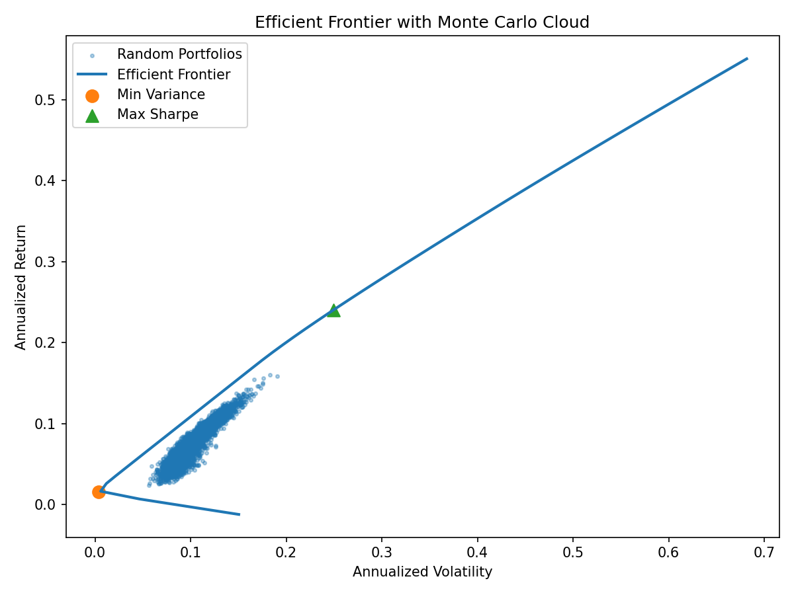
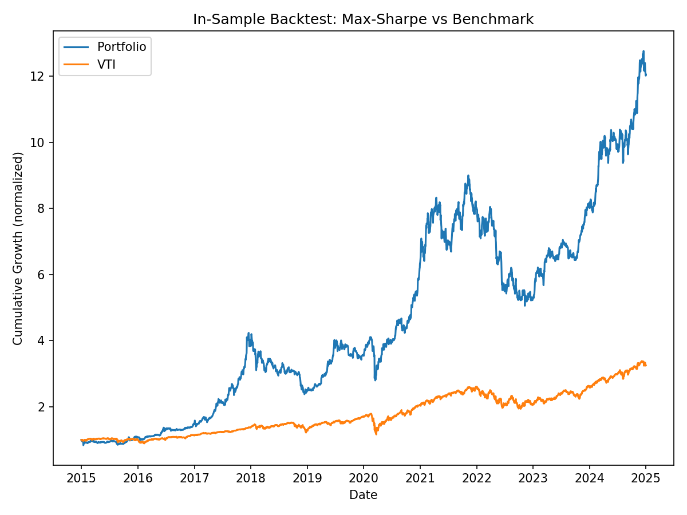

# Portfolio Optimization & Risk Modeling (Python)
End-to-end MVO (Min-Var / Max-Sharpe), Efficient Frontier with Monte Carlo, Risk Parity, Black–Litterman, and optional regime-aware risk targeting. Runs on Yahoo Finance data.

## Quick start
```bash
pip install -r requirements.txt
python portfolio_opt_plus_regime.py --download --rf 0.045 --benchmark VTI   --market_equal --tau 0.2   --regime --regime-window 60 --regime-proxy VTI   --regime-low-pct 0.2 --regime-high-pct 0.8   --regime-low-scale 1.3 --regime-mid-scale 1.0 --regime-high-scale 0.7 --view "BTC-USD:+0.08@0.001,BIL:+0.02@0.001"
<<<<<<< HEAD
=======

>>>>>>> b821ea1 (Add example figures and README image links)


